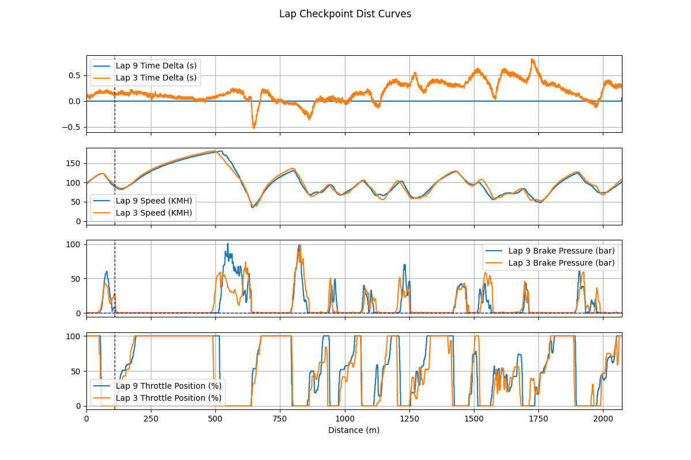
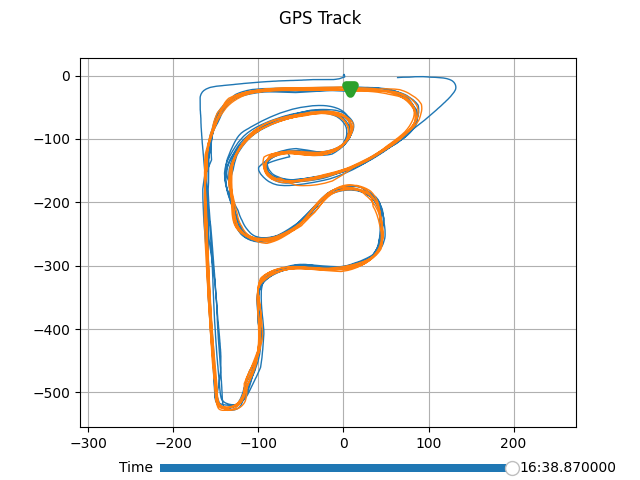

**English Version:**
# TeslaTrackAnalyzer
Draw graphs using data recorded by Tesla Track Mode and visualize this data into video(in future).

**Example：**

Just run ShowCaseOneCsv.py and ShowCaseTwoCsv.py in folder PythonProject.

The following are examples of the drawn graphs. The results may not be exactly the same as the actual output, serving only as representations of several typical graphs:

    

    

    

**Notice:**

When the x-axis represents the distance from the starting point to checkpoints, the following assumptions need to be satisfied:

1. Within the reference lap (the first element in the passed `laps_2_draw` array is taken as the reference lap), the vehicle does not come to a complete stop or rapidly move in the opposite direction of normal track movement within a short time frame.
2. Within the reference lap, when GPS records changes in latitude and longitude of the vehicle, these changes in latitude and longitude reflect the vehicle's actual movement direction, which is generally consistent with the direction of the vehicle's actual movement. This does not require very high GPS accuracy since as long as the vehicle is moving at a sufficient speed, it can introduce enough offset within a single GPS sampling period.

Based on my observations, the track data recorded by Tesla's built-in vehicle system **perfectly aligns with the assumptions** mentioned above.

Additionally, if you are only creating line graphs with time as the x-axis or plotting GPS trace maps, you don't need to worry about this.

**TODO:**

1. Visualize the data into video, like some overlays of speed, throttle, brake, g-meter...
2. If someone has recorded track data using methods other than Tesla's Track Mode and wishes to use this project but finds that the current project doesn't perfectly adapt, I will enhance the project's versatility. This may include the ability to plot distance-based graphs without needing to meet the assumptions mentioned above, providing a user interface (UI) to cater to a wider range of needs...

**中文版：**
# 特斯拉赛道模式数据分析器
使用特斯拉赛道模式记录的数据绘制图形，并将这些数据可视化为视频（未来的计划）。

**示例：**

只需运行 PythonProject 文件夹中的 ShowCaseOneCsv.py 和 ShowCaseTwoCsv.py 。

以下是绘制图表的示例。结果可能与实际输出不完全相同，仅用作几种典型图表的代表：

    

    

    

**注意：**

当 x 轴表示从起点到检查点的路程时，需要满足以下假设：

1. 在参考圈内（传入的 `laps_2_draw` 数组的第一个元素会被作为参考圈），车辆没有完全停止或在短时间内迅速向正常行驶方向的相反方向迅速移动。
2. 在参考圈内，当 GPS 记录车辆的纬度和经度发生变化时，所记录的纬度和经度变化反映了车辆的实际运动方向，通常与车辆实际运动方向基本一致。这并不需要非常高的 GPS 精度，因为只要车辆以足够快的速度运动，就能在一个 GPS 采样周期内引入足够的偏移。

根据我的观察，特斯拉车辆内置系统记录的赛道数据**完美地符合**上述假设。

此外，如果您只是使用时间作为 x 轴创建线图，或者绘制 GPS 轨迹图，那么您无需担心这些。

**待办事项：**

1. 将数据可视化为视频，例如叠加一些速度、油门、刹车、g值的图层...
2. 如果有人使用特斯拉赛道模式以外的方式录制了赛道数据，想要使用此项目但发现当前项目不能完美适配，我将增强项目的通用性。这可能包括无需满足上述假设就能绘制横坐标为路程的log对比图，提供用户界面（UI）以满足更广泛的需求...