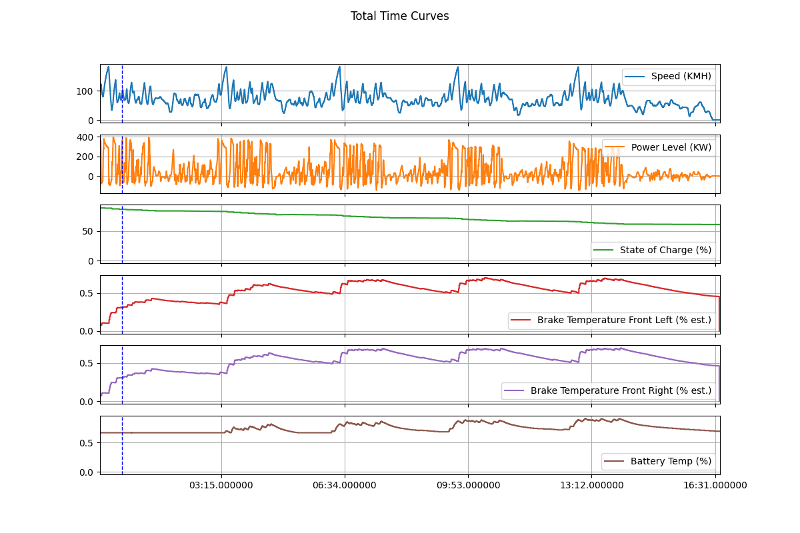

# TeslaTrackAnalyzer
Draw graphs using data recorded by Tesla Track Mode and visualize this data into video(in future)

**Example：**

Just run /PythonProject/main.py

    

    

    

**Notice:**

When the x-axis represents the distance from the starting point to checkpoints, the following assumptions need to be satisfied:

1. Within the reference lap (the first element in the passed `laps_2_draw` array is taken as the reference lap), the vehicle does not come to a complete stop or rapidly move in the opposite direction of normal track movement within a short time frame.
2. Within the reference lap, when GPS records changes in latitude and longitude of the vehicle, these changes in latitude and longitude reflect the vehicle's actual movement direction, which is generally consistent with the direction of the vehicle's actual movement. This does not require very high GPS accuracy since as long as the vehicle is moving at a sufficient speed, it can introduce enough offset within a single GPS sampling period.

Based on my observations, the track data recorded by Tesla's built-in vehicle system **perfectly aligns with the assumptions** mentioned above.

Additionally, if you are only creating line graphs with time as the x-axis or plotting GPS trace maps, you don't need to worry about this.

**TODO:**

1. Visualize the data into video, like some overlays of speed, throttle, brake, g-meter...
2. If someone has recorded track data using methods other than Tesla's Track Mode and wishes to use this project but finds that the current project doesn't perfectly adapt, I will enhance the project's versatility. This may include the ability to plot distance-based graphs without needing to meet the assumptions mentioned above, providing a more extensive user interface (UI) to cater to a wider range of needs...